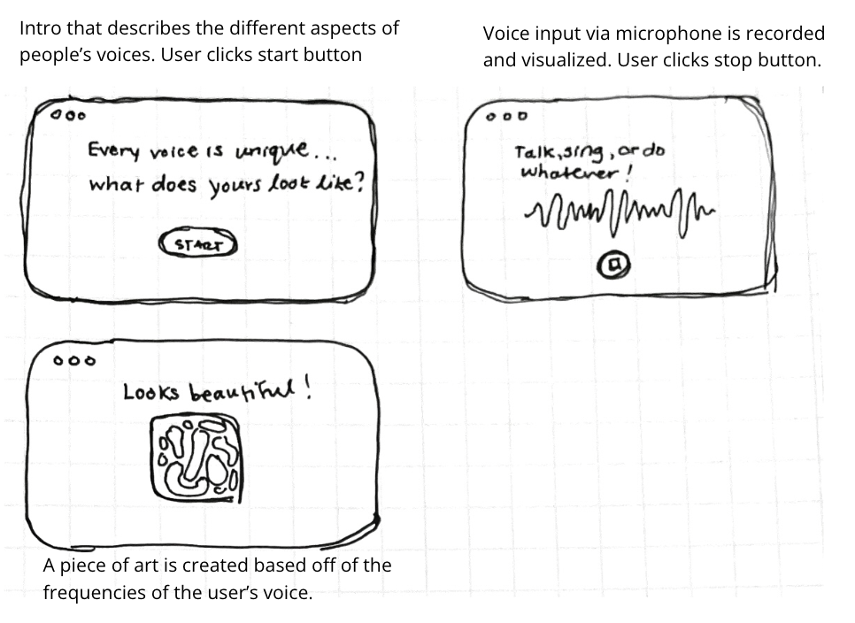

<mark>**Note that this document order from FP4 -> FP1**</mark>

<mark>Please sign up for the study</mark> at [https://tinyurl.com/pui-study](https://tinyurl.com/pui-study) to allow us to use your submission to create a better GenAI assistant for designers!

---

# **FP4 \- Final Project Writeup**

Feel free to refer to this [Markdown Cheat Sheet](https://www.markdownguide.org/cheat-sheet/) to make your writeup more organized, and you can preview your markdown file in VSCode [Markdown editing with Visual Studio Code](https://code.visualstudio.com/docs/languages/markdown#_markdown-preview).

## Part 1: Website Description

Describe your website (300 words).

- What is the purpose of your website?
- Who is the target audience?
- What information do you convey with your website?
- How is it interesting and engaging?

## Part 2: User Interaction

How a user would interact with your website? For each step, briefly but clearly state the interaction type & how we should reproduce it.

1. Interaction type. Click on X on page Y / scroll on page X, etc.
2.

## Part 3: External Tool

Describe what important external tool you used (JavaScript library, Web API, animations, or other). Following the bulleted list format below, reply to each of the prompts.

1. Name of tool1
   - Why did you choose to use it over other alternatives? (2 sentences max)
   - How you used it? (2 sentences max)
   - What does it add to your website? (2 sentences max)
2. Name of tool2

## Part 4: Design Iteration

Describe how you iterated on your prototypes, if at all, including any changes you made to your original design while you were implementing your website and the rationale for the changes. (4-8 sentences max)

## Part 5: Implementation Challenge

What challenges did you experience in implementing your website? (2-4 sentences max)

## Part 6: Generative AI Use and Reflection

Describe how you used Generative AI tools to create this final project (fill in the following information, write \~500 words in total).

Document your use of all GenAI tools — ChatGPT, Copilot, Claude, Cursor, etc. using the template below. Add/Delete rows or bullet points if needed, and replace Tool1/Tool2 with the name of the tool.

### Usage Experiences by Project Aspects

Feel free to edit the column \_ (other?) or add more columns if there's any other aspect in your project you've used the GenAI tools for.

For the following aspects of your project, edit the corresponding table cell to answer:

- _Usage_: Whether you used / did not use this tool for the aspect. Enter [Yes/No]
- _Productivity_: Give a rating on whether this tool makes your productivity for X aspect [1-Much Reduced, 2-Reduced, 3-Slightly Reduced, 4-Not Reduced nor Improved, 5-Slightly Improved, 6-Improved, 7-Much Improved].

| Tool Name | Ratings      | design | plan   | write code | debug  | \_ (other?) |
| :-------- | :----------- | :----- | :----- | :--------- | :----- | :---------- |
| Tool1     | Usage        | Yes/No | Yes/No | Yes/No     | Yes/No | Yes/No      |
| Tool1     | Productivity | 1~7    | 1~7    | 1~7        | 1~7    | 1~7         |
| Tool2     | Usage        | Yes/No | Yes/No | Yes/No     | Yes/No | Yes/No      |
| Tool2     | Productivity | 1~7    | 1~7    | 1~7        | 1~7    | 1~7         |

### Usage Reflection

> Impact on your design and plan

- It matched my expectations and plan in [FP2](#generative-ai-use-plan) in that … For example,
  1. Tool1:
  2. Tool2:
- It did not match my expectations and plan in [FP2](#generative-ai-use-plan) in that … For example,
  1. Tool1:
  2. Tool2:
- GenAI tool did/did not influence my final design and implementation plan because … For example,
  1. Tool1:
  2. Tool2:

> Use patterns

- I accepted the generations when … For example,
  1. Tool1: this tool once suggested … and I adjusted my design according to the suggestion because …
  2. Tool2:
- I critiqued/evaluated the generated suggestions by … For example,
  1. Tool1: this tool once suggested … but I modified/rejected the suggestion because …
  2. Tool2:

> Pros and cons of using GenAI tools

- Pros
  1. Tool1:
  2. Tool2:
- Cons
  1. Tool1:
  2. Tool2:

### Usage Log

Document the usage logs (prompts and chat history links) for the GenAI tools you used. Some tools may not have an easy way to share usage logs, just try your best! Some instructions for different tools:

1. [ChatGPT](https://help.openai.com/en/articles/7925741-chatgpt-shared-links-faq) / [Gemini](https://support.google.com/gemini/answer/13743730?hl=en&co=GENIE.Platform%3DDesktop): share the anonymous link to all of your chat histories relevant to this project
2. [GitHub Copilot (VSCode)](<https://code.visualstudio.com/docs/copilot/copilot-chat#:~:text=You%20can%20export%20all%20prompts%20and%20responses%20for%20a%20chat%20session%20in%20a%20JSON%20file%20with%20the%20Chat%3A%20Export%20Session...%20command%20(workbench.action.chat.export)%20in%20the%20Command%20Palette.>): export chat histories relevant to this project.

---

# **FP3 \- Final Project Check-in**

Document the changes and progress of your project. How have you followed or changed your implementation & GenAI use plan and why? Remember to commit your code to save your progress.

## Implementation Plan Updates

- [ ] ...

## Generative AI Use Plan Updates

- [ ] ...

Remember to keep track of your prompts and usage for [FP4 writeup](#part-6-generative-ai-use-and-reflection).

---

# **FP2 \- Evaluation of the Final project**

## Project Description

Briefly restate your motivation and a short description of your project.

## High-Fi Prototypes

### _Prototype 1_

A brief description and summary of the user feedback (\<100 words, 2 images)

### _Prototype 2_

…

## Usability Test

Discuss the user feedback you got during the evaluation / usability test (\~300 words). Indicate which feedback you implemented, inspired new directions, or otherwise influenced your final design.

## Updated Designs

Show screenshots of your updated design based on the user feedback (\<100 words, \~2 images).

## Feedback Summary

Summarize the feedback you received in the lab session and discuss how it influenced your design (\~300 words).

## Milestones

Outline weekly milestones to plan your expected implementation progress until the end of the semester (\~300 words).

### _Implementation Plan_

- [ ] Week 9 Oct 28 \- Nov 1:
  - [x] FP1 due
  - [ ] ...
- [ ] Week 10 Nov 4 \- Nov 8:

  - [ ] FP2 due

- [ ] Week 11 Nov 11 \- Nov 15:
- [ ] Week 12 Nov 18 \- Nov 22:
- [ ] Week 13 Nov 25 \- Nov 29:

  - [ ] Thanksgiving

- [ ] Week 14 Dec 2 \- Dec 6:
  - [ ] FP4 due

### _Libraries and Other Components_

List the JS libraries and other components (if applicable) that you plan to use.

-

## Generative AI Use Plan

Outline how you plan to use Generative AI tools to aid in the implementation (\~300 words).

### _Tool Use_

What would you use? Edit the list given your plan. For each tool, explain briefly on what do you expect Generative AI to help you with and what might it not be able to help you with.

- ChatGPT
  - I will use it for … because it can help me …
  - I will not use it for … because it might not be able to help me with …
- GitHub Copilot
- ...

### _Responsible Use_

How would you use Generative AI responsibly?

---

# **FP1 \- Proposal for Critique**

## Idea Sketches

### _Idea 1_

Basic Idea: The intention of this project is to make knowledge of world events that have a long history more accessible to younger generations so they can better understand their current context and when history is cyclical.

Information: NYT articles, year they are published, who they are written by, and the location that is written about.

Plan for Interactivity: Users can use a linear slider with tick marks to change the year of the articles that appear on the map and can click the article to read it. I also would like the user to be able to zoom in and out with the trackpad and be able to drag the globe around.

Plan for Accessibility: The articles could be accessible on the map for screenreaders via the arrow keys for those with impaired vision. Articles could also be accessed through a table of contents. Moving around the map, users could also zoom in and out of the map by double tapping a spot on the map and then dragging down to zoom in or dragging up to zoom out for those with limited hand mobility. I need to ensure type sizes are large enough (perhaps could increase size in accessibility mode) and the map colors are accessible.

### _Idea 2_

Basic Idea: The intention of this project is to showcase my knowledge of coding game logic and animation. 270 to win is a tool that helps you visualize different paths for presidential canidates to win the electoral college.

Information: The canidates running, how many electoral votes they need to reach 270, which states are swing states, and states' number of electoral votes.

Plan for Interactivity: Users can drag around representations of the swing states and drag them over to a canidate. It will fill up a container for that canidate and once 270 is reached, will show that canidate as the winner.

Plan for Accessibility: The text can be accessible via screen reader and users could select a swing state via keyboard. However, I think more needs to be done to make it accessible. Maybe once you select a swing state, a screen reader could present the canidate options. Once you hit enter, the votes go to that canidate. Sound could be incorporated as well.
…

### _Idea 3_

Basic Idea: The intention of this project is to try something really experiemental by visualizing the human voice in terms of color.

Information: The audio recorded would include different frequencies.

Plan for Interactivity: Users can click start and record their voice. Once they click stop, the program generates an art piece.

Plan for Accessibility: It could be accessible via screenreader for those who are visually impaired. I would have to generate alt text for each piece to describe what it looks like. The voice can also be extended to other ways human make noises, whether that be through the vocal cords or hands etc.

…

## Feedback Summary

Idea 1:
I recieved a lot of feedback on how to make this idea more within scope for this project. One idea was to chose a limited amount of topics and subtopics so they can be eaily organized. Some people also had ideas on how I could present the topic in a smaller scope by using the timeline function for only one topic or region at a time (the evolutionary history of humans would be interesting for this). People recommended that I look at how the NYT API is structured and build my application to easily follow that instead of trying to use and vet many publication APIs into my project.
I also got some advice on how to best present it functionally. I should make sure that when the user zooms out it scales (shows less articles) so that it is not overwhelming. When I expressed worry about articles being offensive as a product of their time someone suggested that I could present a disclaimer so users can think more critically.

Idea 2:
I recieved less feedback for this idea, but some people thought that I could add more information to encourage action (like where to find your polling place etc.). Multiple people also suggested that I could make the "swing states" the actual shapes of those states. I think the visual direction could be interesting to play around with.

Idea 3:
People validated that this could be done somewhat easily with p5.js, which was great to hear since feasibility was one of my concerns. People also suggested that instead of random colors, I could use the rainbow spectrum. I got some good feedback that surrounded the idea that art doesn’t have to be useful because you never know what it will turn into.

## Feedback Digestion

Digest the feedback you got in the lab (\~300 words). Indicate which critique you will act on in your next design and why you chose to incorporate/dismiss pieces of critique.

Idea 1:
I like limiting this project to the NYT API as it will make it easier to fit within the scope and it might be something I can display on a portfolio. I think I will definitley need to understand how much information is in the archive to decide how to break down topics. I will take the advice on the functionality for zooming out and scaling it to show less articles as well as inlcuding the disclaimer. I love the idea of mapping out a timeline of human history but also I'm more interested in event histories that are more related to current events.

Idea 2:
I think the developer side of me thinks that the 270 to win game would be the most satisfying. I think it would be a really nice touch to add in information at the bottom of the page directing you to find out if you are registered to vote and to find your polling station, but I didn't like the idea of putting a bunch of other information about predictions and pathways in the spirit of keeping things clean and within scope. I honestly don't really like the idea of making the states less abstract because it feels a bit cheesy, but it's something I could try.

Idea 3:
I still think in my gut that this idea is not actually easy to implement. I would hate for the visual design to suffer for the sake of getting things to work and I'm not sure if I would learn as much by applying, but moreso learn by researching into this niche thing. I would definitely map out the frequencies to the color spectrum, although this would require some math I believe.
